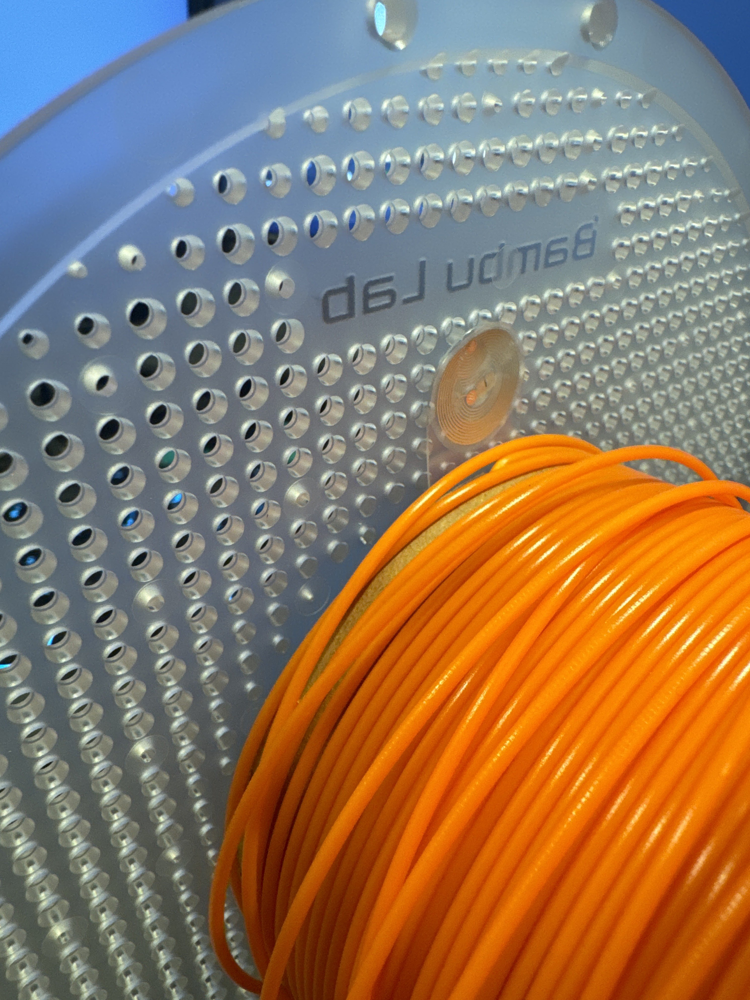
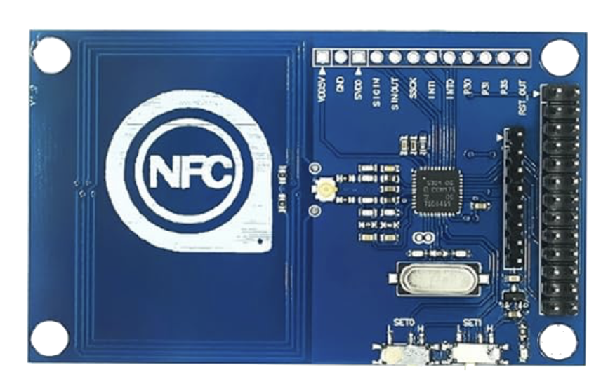
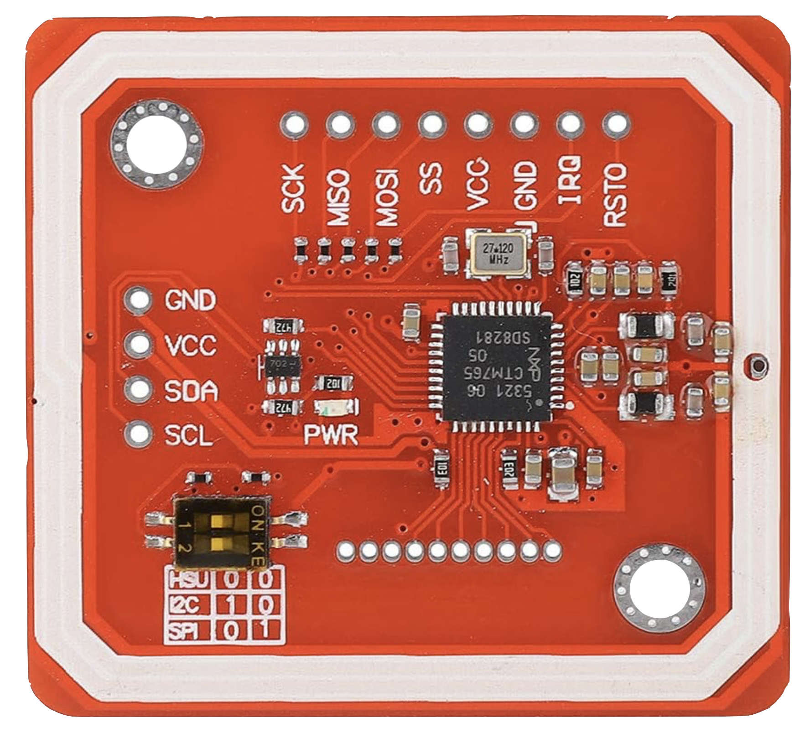
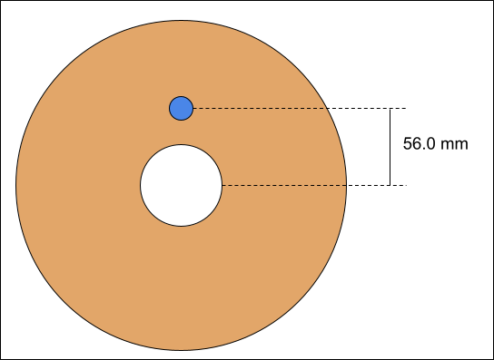
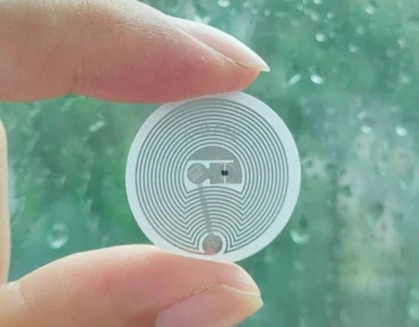

# Open Source RFID Standard (Open 3D-RFID)
More AMS clones are coming, and there shouldn't be a proprietary format for every 3D printer.
This standard is designed to create compatibility across different 3D printers and Filament Manufacturers by creating a format that everyone can follow

We want to make a standard that is simple to implement and as future-proof as possible. Therefore, it's important to get input from Filament Manufacturers, 3D Printer Manufacturers, and smart people in the 3D Printer community.

# Table of Contents
* [Backers](#backers)
* [Why RFID](#why-rfid)
* [Add RFID support to your printer](#add-rfid-support-to-your-printer)
* [RFID Hardware](#rfid-hardware)
* [Mechanical Requirements](#mechanical-requirements)
* [Data Structure](#data-structure)
    * [RFID Memory](#rfid-memory)
    * [Lookup Tables vs Plain-Text](#lookup-tables-vs-plain-text)
    * [Data Points](#data-points)
    
# Backers
These are companies that are implementing Open 3D-RFID into their printers, filament, add-ons, etc.  If you would like to join this list, please open an Issue on GitHub.
* Filament Manufacturers (Sorted by date backed):
  * [Polar Filament](https://polarfilament.com)
  * [3D Fuel](https://www.3dfuel.com/)
  * [Ecogenesis Biopolymers](https://ecogenesisbiopolymers.com)
  * [Numakers](https://numakers.com/)
* Printers + Hardware:
  * [OpenSpool](https://www.youtube.com/watch?v=ah7dm-dtQ5w) ([GitHub Source](https://github.com/spuder/OpenSpool))
  * [Cosmyx](https://www.cosmyx3d.com/)
  * [Distrifab](https://distrifab.fr/)

# Why RFID?
What is the benefit of adding RFID chips to filament?

* AMS / Multi-Material Printers
    * **Color + Material ID:** Simplifying the painting process!  AMS units can automatically detect what filament is loaded up in each slot. This also adds a sanity check before you start printing to make sure you don't end up with a print in the wrong color.
* High-Speed Printing
    * **Advanced Filament Data:** Tags can store advanced per-spool printing data, such as printing/bed temps, melt-flow index, retration, and even filament diameter graphs.  This would make the transition simpler when using filaments from different brands.
* HueForge
    * **Transmission distance + Hex**: Each spool can have a unique TD and color. Saving this data on the spool allows for more accurate tuning, and less math for the consumer
* Every Printer
    * **Filament Remaining Estimation:** Using the RFID tag as an encoder, printers can measure how long it takes for one rotation of a spool of filament, and use this to estimate how much filament is remaining.
    * **Print Profiles**: Each spool can contain print/bed temps, as well as other settings like retraction settings. This makes it much easier to use different brands/colors/materials without worrying about creating a bunch of different slicer profiles.

# Add RFID support to your printer
This standard was designed to be simple to implement in firmware. You will need to add custom firmware and potentially an RFID reader (if your printer doesn't already have one).

RFID support can theoretically be added to any printer using off-the-shelf RFID Modules such as the PN532 (as low as $3). This module communicates over SPI.

Did you make a design to add RFID to your printer? Let us know so we can link to it here!  Designs can be 3D models, or firmware.

# RFID Hardware
MiFare 13.56MHZ Classic 1K tags

These are cheap, common, and allow 1kilobyte of data to be stored on them, which is plenty of space to store required information.  13.56Mhz readers are also very low-cost, and there are plenty of arduino-compatible reader/writers to allow user-made printer upgrades to add RFID support.

# Mechanical Requirements
Requirements are not set in stone.  Still open to discussion. 

Requirements
* Tag center should be 56.0mm away from the center of the spool (see pic)
* The tag should never be more than 4.0mm away from the outside edge of the spool.  For spool sides thicker than 4mm, there must be a cutout to embed the tag, or the tag should be fixed to the outside of the spool
* Two tags should be used, one on each end of the spool

# Data Structure

## RFID Memory
MiFare 1K chips store 1024 bytes across 16 **sectors**, 4 **blocks** per sector, and 16 bytes per block.  The last block of each sector contains key information, and cannot be used for custom data. This means that each sector contains 3 blocks of usable data, for a total of 48 bytes of usable memory per sector

Note: There are 2k chips that allow 2048 bytes, but they are less common and more expensive.

## Lookup Tables vs Plain-Text
This is still open to debate, feel free to weigh in.

In general, this project prefers plain-text over lookup tables for things like material, color, etc.

**Plain Text**: Plain text will store things like color + material as strings.  Examples: `PLA`, `ABS`, `High-Speed PLA`.  Plain text data takes up more room on the chip, but it allows us to future-proof against new materials that don't exist yet.  Downsides about plain text is that there can be variance in naming convention.  One brand might use `HS PLA` and another might use `High-Speed PLA` or even `Fast PLA`.  The freedom to create new materials comes at the cost of inconsistent naming conventions. This makes it difficult if a 3D printer wants to perform special operations based on the material.
Free text also allows manufacturers to decide on their own material names without needing prior approval to be added to a list of approved materials.
Plain text will need a max-string limit, eg "16 bytes".  All strings will occupy this amount of memory, regardless of whether or not they use the entire length.

**Plain Text Example:**

All strings use 16 bytes of memory, unused space is wasted:
 | RFID Memory Contents | Material Name  | Memory Impact |
 |----------------------|----------------|---------------|
 | `"PLA"`              | PLA            | 16-bytes      |
 | `"ABS"`              | ABS            | 16-bytes      |
 | `"High-Speed PLA"`   | High-Speed PLA | 16-bytes      |
    
**Lookup Table**: Lookup tables would map a number to a material. This uses significantly less memory, as the tag only needs to store a number, likely as a 2-byte number (allowing 65,536 different materials). A 2-byte ID would use much less memory than plain-text such as `High-Speed PLA` (which is 14 bytes).  Lookup tables put more stress on 3D printer manufacturers because the firmware would have to store a copy of this lookup table.  If a new material is released in the future, then the printer's firmware would need to be updated to know of its existance.  There would also need to be a committee to decide which materials are allowed to be added to this lookup table.  For example, there are many variants of PLA alone, such as `PLA`, `PLA+`, `HTPLA`, `ePLA`,`Fast-PLA`,`Soft PLA`,`Tough PLA`,`Smoothable PLA`, etc.  There will likely be many more materials that may never catch on.  Once they are added to this lookup table, they will never go away.

**Lookup table example:**
 | Material ID | Material Name | Memory Impact |
 |-------------|---------------|---------------|
 | 1           | PLA           | 2 bytes       |
 | 2           | ABS           | 2 bytes       |
 | 3           | High-Speed PLA| 2 bytes       |

## Data Points
This is a list of data that will live on the RFID chip, separated into required and optional data.  All REQUIRED data must be populated to be compliant with this open source RFID protocol.

1K chips have 1024 bytes of total memory, with 768 bytes of usable memory (remaining memory is used for keys/encryption)

### Required Data
All chips MUST contain this information, otherwise they are considered non-compliant
| Field | Data Type | Size (bytes) | Example | Description
|-------------|---------------|------------|----|-----|
| Tag Version | Int | 2 | `1234` | RFID tag data format version to allow future compatibility in the event that the data format changes dramatically. Stored as an int with implied decimal points. Eg `1000` -> `version 1.000`|
| Filament Manufacturer | String | 16 | `"Polar Filament"` | String representation of filament manufacturer.  16 bytes is the max data length per-block. Longer names will be abbreviated or truncated |
| Material Name | String | 16 | `"PLA"` or `"Glass-Filled PC"` | Material name in plain text |
| Color Name | String | 32 | `"Blue"` or `"Electric Watermellon"` | Color in plain text. Color spans 2-blocks |
| Diameter (Target) | Int | 2 | `1750` or `2850` | Filament diameter (target) in µm (micrometers) Eg "1750" -> "1.750mm"
| Weight (Nominal, grams) | Int |  2 | `1000` (1kg), `5000` (5kg), `750` (750g) | Filament weight in grams, excluding spool weight. This is the TARGET weight, eg "1kg".  Actual measured weight is stored in a different field.
| Print Temp (C)| Int | 2 | `210` (C), `240` (C) | The recommended print temp in degrees-C
| Bed Temp (C) | Int | 2 | `60` (C), `80` (C) | The recommended bed temp in degrees-C |
| Density | Int | 2 | `1240` (1.240g/cm3), `3900` (3.900g/cm3) | Filament density, measured in µg (micrograms) per cubic centimeter.

### Optional Data
This is additional data that not all manufacturers will implement. These fields are populated if available.  All unused fields should be populated with "-1" (all 1's in binary, eg 0xFFFFFFFFFFFFFFFF)

| Field | Data Type | Size (bytes) | Example | Description
|-------------|---------------|------------|----|-----|
| Serial Number / Batch ID | String | 16 | `"1234-ABCD"`, `"2024-01-23-1234"` | An identifier to represent a serial number or batch number from manufacturing. Stored as a string, and this format will vary from manufacturer to manufacturer |
| Manufacture Date | Int | 4 | `20240123` (Jan 23rd, 2024) | Date code in YYYYMMDD format, stored as a 32-bit integer |
| Manufacture Time | Int | 3 | `103000` (10:30am), `152301` (3:23:01pm)  | 24-hour time code in HHMMSS format (Hour, Minumte, Second), specifying UTC.
| Spool Core Diameter (mm) | Int | 1 | `100` (mm), `80` (mm) | The diameter of the spool core, which is the part that the filament is wound around. This diameter is to estimate remaining filament by treating the tag as an encoder, and measuring how long it takes for one rotation of a spool.
| MFI (Melt-flow index) | TBD | TBD | TBD | Format TBD. The melt-flow index describes how "melty" plastic is.  Meltier plastics can usually print faster.  Formula is somewhat complex, and often measured at different temperatures.  For example Corbion LX175 melt flow index is `MFI(210°C/2.16kg) = 6g/10min`, and `MFI(190°C/2.16kg) = 3g/10min`
| Tolerance (Measured) | Int | 1 | `20` (±0.020mm), `55` (±0.055mm) | Actual tolerance, measured in µm (micrometers). This field is unique to each spool, and should only be populated if per-spool tolerances are measured and recorded during manufacturing. This is not a TARGET tolerance, this is ACTUAL.  If not recorded, leave undefined (0xFF)
| Additional Data URL | String | 32 | `pfil.us?i=8078-RQSR` | URL to access additional data in JSON format. This data may be unique to this spool, or just general info about this material.  All urls must be https, and the "https" at the beginning is implied. Eg `pfil.us?i=8078-RQSR` becomes `https:pfil.us?i=8078-RQSR`, formatted this way to save memory.
| Empty Spool Weight (g) | Int | 2 | `105` (105 grams) | Weight of the empty spool in grams. This can be used to calculate how much filament is remaining on each spool
| Filament Weight (Measured) | Int | 2 | `1002` (1002 grams) | ACTUAL weight of the filament, excluding empty-spool weight. Measured after filament manufacturing.  This is not the target weight (eg 1kg) but rather the actual weighed result (eg 1.002kg).
| Filament Length (Measured) | Int | 2 | `336` (336 meters) | ACTUAL length of filament measured in meters.  This is unique to each spool.
| TD (Transmission Distance) | Int | 2 | `2540` (2.540mm) | Transmission Distance in µm (micrometers). Transmission distance is the distance at which no light can pass through the filament.  See the HueForge project for more details |
| Color Hex | Int | 3 | `0xffa64d` (Light orange color) | Color hexcode. Hex is a 3-byte number in the format 0xRRGGBB (Red, Green, Blue, one byte each) |
| Max Dry Temp (C) | Int | 1 | `55` (55C), `50` (50C) Maximum drying temperature in Degrees-C. Drying above this temperature can damage the filament

## Memory Map
A list of where each datapoint lives in memory, sorted into sectors and blocks.  This will be generated after the [Data Points](#data-points) section has been mostly finalized.
